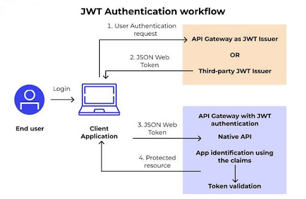

# JWT (JSON Web Token)

JWT es un estándar definido por la RFC 7519 utilizado para la transmisión segura de información entre partes mediante objetos JSON. Permite verificar la autenticidad del remitente de una solicitud y garantizar que el contenido no haya sido modificado durante la comunicación.

Una de sus principales características es que se trata de un token autocontenido, es decir, puede incluir dentro de sí mismo información relevante del usuario o de la sesión, evitando consultas constantes al servidor y facilitando los servidores stateless.

## Estructura de un JWT

Un JWT posee una estructura compuesta por tres partes separadas por puntos:

Header.Payload.Signature

- **Header:** encabezado donde se especifica el tipo de token y el algoritmo de firma utilizado, por ejemplo HS256 o RS256.  
- **Payload:** contiene los datos o *claims*, es decir, información asociada al usuario y atributos necesarios para la autenticación o autorización, como identificador, rol o fecha de expiración.  
- **Signature:** firma digital generada a partir del Header, el Payload y una clave secreta o privada. Su función es validar la integridad del token y comprobar que no haya sido alterado.

## Funcionamiento

Como indica la imagen, el usuario inicia sesión desde una aplicación Android o Web. Las credenciales son enviadas a la API, donde el servidor las valida. Si son correctas, genera un token JWT firmado digitalmente y lo devuelve al cliente. A partir de ese momento, el cliente enviará el token en cada solicitud protegida mediante el encabezado:

El servidor verificará la firma y vigencia del token antes de responder.

### Flujo del proceso

- Usuario inicia sesión.  
- El cliente envía credenciales a la API.  
- El servidor valida al usuario.  
- Se genera un JWT.  
- El servidor devuelve el token.  
- El cliente lo almacena localmente.  
- El cliente lo envía en solicitudes protegidas.  
- El servidor valida el token y responde.  

## Diferencias entre Android y Web

La principal diferencia entre acceder desde una aplicación Android nativa y una aplicación Web radica en las librerías utilizadas y en la forma de almacenamiento del token.

En una aplicación Android nativa es común utilizar librerías como Retrofit u OkHttp para consumir la API, mientras que el token puede almacenarse mediante SharedPreferences, EncryptedSharedPreferences o mecanismos más seguros provistos por el sistema operativo.

En una aplicación Web, en cambio, la comunicación con la API suele realizarse mediante Fetch API, Axios u otras herramientas del frontend. El token generalmente se almacena en localStorage, sessionStorage o cookies seguras, dependiendo de la arquitectura elegida.

Sin embargo, este entorno suele estar más expuesto a riesgos como ataques XSS o accesos desde scripts maliciosos si no se aplican buenas prácticas de seguridad. En una aplicación Android nativa, el almacenamiento local puede apoyarse en mecanismos más robustos del sistema operativo, como almacenamiento cifrado o el uso del Keystore, por lo que generalmente ofrece un nivel de protección superior para resguardar credenciales y tokens.
